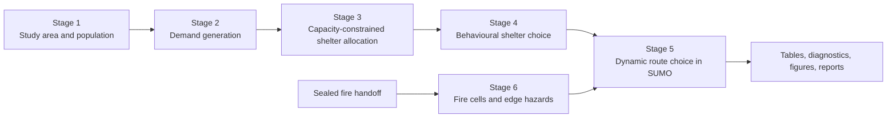

# behaviour-eva

`behaviour-eva` is a formula-based research codebase for studying car evacuation under a spreading-fire hazard. Its six-stage design separates population and demand generation, capacity-constrained shelter planning, individual shelter-choice behaviour, dynamic route choice, and fire-to-road hazard integration.

The research target is Toulouse. The repository also contains a configuration-driven Manhattan Stage 3–6 integration track used to verify software contracts, deterministic execution, hazard reconstruction, routing, and diagnostics on a sealed fire dataset. Manhattan results are **synthetic, uncalibrated software evidence**; they are not Toulouse validation or final scientific approval.

There is no learned model, LLM, or multi-agent reinforcement-learning component. Behaviour is defined by explicit, configurable mathematical formulas.

## Project status

- The six-stage architecture and development plan are documented under [`files/`](files/).
- Stage 4 uses the active `softmax_c1_v1` shelter-choice model: raw `W` scores are converted to softmax `S` shares, and only final `V_p`, `V_s`, and `V_g` weights compose shelter probabilities.
- The Manhattan Stage 3–6 pipeline supports validated configuration loading, capacity-constrained allocation, Stage 4 behaviour, dynamic SUMO routing, cell-to-edge fire hazard reconstruction, reproducible outputs, and scientific diagnostics.
- SimFire is executed separately. The active Manhattan integration consumes a sealed, precomputed fire handoff and does not run SimFire as part of the traffic pipeline.
- Behavioural calibration, fire calibration, Toulouse execution, and final research approval remain provisional.

## Technology stack

| Area | Technology |
|---|---|
| Language | Python 3.11 or newer |
| Traffic simulation | Eclipse SUMO, TraCI, `sumolib` |
| Scientific computing | NumPy, SciPy, pandas |
| Spatial processing | GeoPandas, Shapely |
| Data contracts | YAML, JSON Schema, JSON, Parquet, GeoJSON, SUMO XML |
| Visualization | Matplotlib |
| Testing | pytest |
| Fire input | Sealed SimFire-derived cell-state handoff; SimFire 2.0.1 has a separate isolated environment |

The package metadata and primary dependencies are defined in [`pyproject.toml`](pyproject.toml). [`requirements.txt`](requirements.txt) provides a flat dependency list. The isolated SimFire environment is documented separately in [`environments/environment-simfire.yml`](environments/environment-simfire.yml) and is not the environment specification for the main traffic pipeline.

## Architecture

The project uses versioned tabular and spatial files between stages so that each stage can be inspected or rerun from persisted inputs. SUMO and the fire model are coupled through a one-way, offline handoff; the traffic simulation does not change fire propagation.



The principal runtime modules are:

- `population_synth`: synthetic population generation.
- `shelter_allocation`: travel-cost calculation and exact capacity-slot assignment.
- `behavioral_model`: attractiveness, panic sampling, `softmax_c1_v1`, and shelter sampling.
- `route_choice`: candidate routes, utility, risk, and hazard-provider interfaces.
- `fire_sim`: fire grids, cell states, edge-cell intersections, edge hazard, and survival.
- `manhattan.integration`: validated Stage 3–6 orchestration, provenance, SUMO phases, parity, reporting, and risk plots.
- `sumo_integration`: SUMO network preparation and inspection.

The current graph report identifies `ResolvedIntegrationConfig`, table I/O, risk-plot generation, Stage 4 execution, and mixture-weight calculation as central abstractions, with no import cycles detected. See [`graphify-out/GRAPH_REPORT.md`](graphify-out/GRAPH_REPORT.md).

## Key scientific formulas

Stage 4 shelter choice uses:

```text
P_i(j) = V_g(x_i) P_g(i,j) + V_s(x_i) P_s(i,j) + V_p(x_i) P_p(i,j)
```

Here, `W_s/W_g` are raw scores, `S_s/S_g` are stable softmax shares of non-panic behaviour, and only `V_p/V_s/V_g` are probabilities. The panic rate is sampled once from a seeded truncated normal and is persisted unchanged for Stage 5.

The active cell-to-edge hazard contract uses:

```text
H_e(t) = Σ_c h_c(t) · ℓ_e,c / L_e
S_e(t) = exp(-λ · H_e(t))
S_k(t) = exp(Σ_e log(clip(S_e(t), ε, 1)))
R_k(t) = 1 - S_k(t)
```

Route-choice utility combines normalized travel time and route risk. Scientific coefficients and tolerances come from validated configuration; they are not hidden command-line defaults.

## Getting started

### Prerequisites

- Python 3.11+
- A virtual or Conda environment
- SUMO available on `PATH` for traffic execution
- `sumo-gui` and a working display only for GUI-enabled runs
- Git Bash, MSYS2, or WSL to use the Bash wrappers on Windows
- The complete sealed fire-handoff directory referenced by the selected runtime YAML

SimFire is not required to run the main Manhattan pipeline because the pipeline consumes precomputed fire-cell snapshots. Do not reuse the separate SimFire environment as the main application environment.

### Install the Python project

```bash
python -m venv .venv
source .venv/bin/activate
python -m pip install --upgrade pip
python -m pip install -e ".[test]"
```

On PowerShell, activate the environment with:

```powershell
.\.venv\Scripts\Activate.ps1
python -m pip install --upgrade pip
python -m pip install -e ".[test]"
```

Confirm external tools before a SUMO run:

```bash
python --version
sumo --version
python -c "import numpy, pandas, scipy, shapely, sumolib; print('Python dependencies OK')"
```

### Validate configuration without running SUMO

The integration CLI accepts common and runtime YAML paths. It does not expose scientific parameter overrides:

```bash
python -m evacuation_sim.manhattan.integration validate \
  --common-config configs/test/common_manhattan_test.yaml \
  --runtime-config configs/test/manhattan_stage3_to_stage6_fire_runtime_v012.yaml
```

Individual stage YAML files can be checked against their schemas, for example:

```bash
python scripts/validate_config.py \
  configs/stage4.yaml \
  configs/schemas/stage4.schema.json
```

### Run the Manhattan Stage 3–6 pipeline

The Bash wrapper executes:

```text
validate → prepare → headless → finalize → optional risk-plots
```

For the v012 configuration and its visualization sidecar:

```bash
export PYTHON_BIN=python
bash bashscript/run_pipeline.sh \
  configs/test/common_manhattan_test.yaml \
  configs/test/manhattan_stage3_to_stage6_fire_runtime_v012.yaml \
  configs/test/manhattan_stage3_to_stage6_risk_plots_v012.yaml
```

Existing run directories are intentionally protected. Before a new run, copy the appropriate runtime YAML and change at least:

```yaml
execution:
  run_id: "a-new-unique-run-id"
  output_root: "outputs/test/manhattan/integration/a-new-unique-run-id"
  fail_if_output_exists: true
```

Do not point a new run at an existing output directory or reuse fire snapshots after changing scientific fire parameters. See [`bashscript/README.md`](bashscript/README.md) for phase-by-phase commands and [`reports/manhattan_stage3_to_stage6_fire_pipeline_reproduction.md`](reports/manhattan_stage3_to_stage6_fire_pipeline_reproduction.md) for the complete reproduction procedure.

## Project structure

```text
behaviour_eva/
├── src/evacuation_sim/   Python package and scientific/runtime modules
├── configs/              Active YAML configurations and JSON schemas
├── tests/                Unit, integration, and independently checkable fixtures
├── scripts/              Validation, diagnostics, handoff, and plotting entry points
├── bashscript/           Stage 3–6 phase wrappers and operator instructions
├── data/                 Networks, fixtures, and sealed external handoffs
├── outputs/              Versioned generated results and historical evidence
├── reports/              Audits, run reports, handoffs, and reproduction guides
├── files/                Research architecture, implementation, testing, and risk plans
├── environments/         Environment specifications, including isolated SimFire setup
└── graphify-out/         Generated code-graph report and cache
```

Generated outputs and historical artifacts may be checksum-protected. Treat them as evidence: create a new versioned output root instead of overwriting them.

## Key features

- Six-stage, configuration-driven evacuation architecture.
- Capacity-constrained Stage 3 shelter allocation.
- Numerically stable Stage 4 `softmax_c1_v1` behavioural weights with deterministic panic sampling.
- Corrected travel-time and disaster-angle shelter attractiveness.
- Dynamic Stage 5 route reconsideration using travel time, route risk, and panic mixtures.
- Exact cell-to-edge geometric overlap and length-weighted Stage 6 hazard aggregation.
- Previous-snapshot hazard lookup with explicit missing-data failures.
- Immutable, hash-validated fire handoffs and independently reconstructed hazard oracles.
- Isolated RNG streams, reproducible SUMO seeds, provenance manifests, and SHA-256 output manifests.
- Headless and optional GUI traffic runs with scientific parity checks.
- Fire, route-risk, traffic-flow, exposure, shelter-choice, and spatial route diagnostics.
- Optional runtime demand and shelter overrides without mutating the common scientific contract.

## Configuration

Configuration is split by responsibility:

- [`configs/base.yaml`](configs/base.yaml) and `configs/stage1.yaml` through `stage6.yaml` define the general six-stage model.
- [`configs/schemas/`](configs/schemas/) contains strict stage and runtime schemas.
- [`configs/test/common_manhattan_test.yaml`](configs/test/common_manhattan_test.yaml) is the accepted Manhattan common contract for the sealed handoff.
- Versioned `configs/test/manhattan_stage3_to_stage6_fire_runtime_*.yaml` files define operational runs.
- Separate visualization YAML files define plotting semantics and source hashes.

Scenario-dependent IDs, paths, filenames, hashes, seeds, colors, and acceptance values belong in validated YAML or fixture data, not reusable production modules. Scientific changes require a new run identity and, when fire inputs change, a new complete sealed handoff.

## Development workflow

1. Create a versioned YAML configuration and a fresh output root.
2. Run validation-only checks before creating outputs.
3. Run focused unit and integration tests.
4. Execute phases explicitly: `prepare`, `headless`, optional `gui`, optional `parity`, then `finalize`.
5. Generate sidecar diagnostics only from hash-verified persisted scientific tables.
6. Verify output `SHA256SUMS` and immutable-input before/after hashes.
7. Report software status separately from scientific interpretation and research approval.

The repository does not currently document a Git branching strategy. Preserve unrelated worktree changes and keep scientific-model edits narrowly scoped and reviewable.

## Coding standards

The codebase follows these observed conventions:

- Use type hints and small, testable functions for scientific formulas.
- Pass validated configuration and tables explicitly; avoid environment-dependent scientific defaults.
- Keep scenario-specific values out of reusable production code.
- Use seeded `numpy.random.Generator` instances and record derived RNG streams.
- Validate shapes, finite values, units, keys, probabilities, coverage, and cross-field constraints early.
- Fail with actionable errors for missing or ambiguous scientific data; do not silently interpolate, normalize, clip, or substitute unless the contract explicitly permits it.
- Preserve versioned Parquet/CSV/GeoJSON/JSON contracts between stages.
- Treat SUMO `.add.xml`, screenshots, and maps as visualization artifacts; scientific tables are authoritative.
- Distinguish technical verification from calibration, causal interpretation, and research approval.

Use the pure-function implementations and tests in [`src/evacuation_sim/behavioral_model/stage4_core.py`](src/evacuation_sim/behavioral_model/stage4_core.py), [`src/evacuation_sim/fire_sim/edge_hazard.py`](src/evacuation_sim/fire_sim/edge_hazard.py), and [`tests/unit/`](tests/unit/) as exemplars.

## Testing

The testing strategy has three levels:

- **Unit tests:** deterministic formula, validation, geometry, RNG, and table-contract checks.
- **Integration tests:** small fixtures and cross-stage contracts, including Stage 3→4, Stage 4→5, fire handoff, hazard provider, and pipeline smoke tests.
- **Research validation:** statistical and visual review on a scientifically relevant scenario. Passing software tests does not provide this approval.

Run the complete configured pytest suite with:

```bash
python -m pytest
```

Run the focused Manhattan Stage 3–6 checks with:

```bash
export PYTHON_BIN=python
bash bashscript/run_tests.sh \
  configs/test/common_manhattan_test.yaml \
  configs/test/manhattan_stage3_to_stage6_fire_runtime_v012.yaml
```

Some historical integration tests write under `outputs/test/manhattan`. Read the relevant test and runtime configuration before running it against preserved artifacts. Numerical tolerances, seeds, and fixture acceptance values are configuration-driven.

## Documentation

- [Project understanding](files/00_project_understanding.md)
- [System architecture](files/01_architecture.md)
- [Implementation plan](files/02_implementation_plan.md)
- [Testing and validation strategy](files/03_testing_validation_strategy.md)
- [Glossary](files/04_glossary.md)
- [Risk register](files/05_risk_register.md)
- [Stage 6 cell-to-edge plan](files/07_stage6_cell_to_edge_implementation_plan.md)
- [Manhattan Stage 3–6 reproduction guide](reports/manhattan_stage3_to_stage6_fire_pipeline_reproduction.md)
- [Stage 4 softmax integration report](reports/stage4_softmax_mixture_weight_integration_report.md)
- [Stage 6 SimFire handoff](reports/stage6_simfire_cross_machine_handoff.md)
- [Generated graph report](graphify-out/GRAPH_REPORT.md)

## Contributing

Before proposing a change:

1. Identify whether it is operational, software-contract, or scientific-model work.
2. Do not alter the common contract, sealed fire handoff, scientific formulas, or historical outputs without explicit authorization.
3. Add or update strict schemas and configuration-driven fixtures; do not hardcode scenario identifiers.
4. Add deterministic unit and integration coverage proportional to the change.
5. Run validation and relevant tests, record exact commands, and preserve checksummed artifacts.
6. Explain any scientific assumptions, skipped tests, environment limitations, and backward-compatibility effects.

No standalone `CONTRIBUTING.md` or formal branching policy is currently present. Use the active plans, tests, and existing implementation reports as review guidance.

## License

No license file or package license declaration is currently present. Until a license is added by the project owner, do not assume permission to redistribute or reuse the code outside the applicable project agreement.
