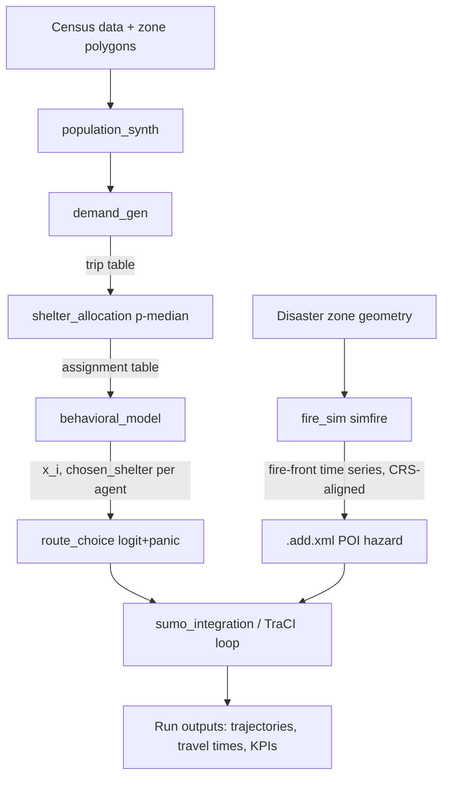

# 01 — System Architecture

## Modules

Stage 4 revision (2026-07-20): `behavioral_model` now implements `softmax_c1_v1`. It samples
one truncated-normal panic rate, computes raw W scores, normalized S shares, and final V
probabilities, then samples from `V_g P_g + V_s P_s + V_p P_p`. Its versioned output records
W/S/V values, planner shelter, chosen shelter, and probability checks while preserving the
existing `panic_rate` and chosen-shelter contract consumed by Stage 5.

| Module | Responsibility | Consumes | Produces |
|---|---|---|---|
| `population_synth` | Generate synthetic Toulouse population from census distributions | Census data, zone polygons | Agent table (home zone, demographic attrs) |
| `demand_gen` | Sample departure times and origin points, snap to SUMO edges | Agent table, SUMO network | Trip table (agent_id, origin_edge, dep_time, dest_zone) |
| `shelter_allocation` | p-median optimal shelter assignment under capacity constraints | Trip table, shelter capacities, travel-time matrix | Assignment table (zone/agent → shelter) |
| `behavioral_model` | Sample one truncated-normal panic rate; compute raw `W_s/W_g`, stable `S_s/S_g`, final `V_p/V_s/V_g`; sample only from the validated V-weighted shelter mixture | Trip table, Stage 3 assignment table, shelter geometry | Versioned behavioral profile, shelter probabilities, chosen shelter, and post-behaviour capacity table |
| `route_choice` | Recompute route distribution every `delta_t` using logit + panic mixture | Agent profile, live hazard state, SUMO/TraCI | Route decisions injected via TraCI |
| `fire_sim` | Run `simfire`, transform coordinates into SUMO CRS, emit `.add.xml` | Disaster zone geometry, ignition config | Fire-front time series, `.add.xml` |
| `sumo_integration` | Own the TraCI session, load `.add.xml`, drive the simulation loop | All of the above | SUMO run outputs (trajectories, travel times) |

## Data contracts

- All inter-module data is passed as versioned tabular files (CSV/Parquet) or GeoJSON for
  spatial objects — no in-memory-only handoffs, so any stage can be re-run independently given
  its inputs.
- Coordinates are always in **SUMO's default network CRS** end-to-end; `fire_sim` is the only
  module that performs a CRS transform (simfire's native output → SUMO CRS), and that
  transform is logged and validated (see `03_testing_validation_strategy.md`).
- `simfire` and SUMO are **not** co-simulated in real time. `fire_sim` runs to completion
  first, producing a discretized fire-front time series; `sumo_integration` consumes that as a
  static, pre-baked `.add.xml` hazard. This is a deliberate simplification (see Risk Register
  R-03) — there is no feedback loop where evacuee behavior affects fire spread, or where
  mid-simulation fire updates trigger anything beyond what's already scheduled in the
  `.add.xml` POI timestamps.

## End-to-end data flow

## Stage-to-module mapping

- Stage 1 → `population_synth`
- Stage 2 → `demand_gen`
- Stage 3 → `shelter_allocation`
- Stage 4 → `behavioral_model`
- Stage 5 → `route_choice`
- Stage 6 → `fire_sim` + `sumo_integration`
